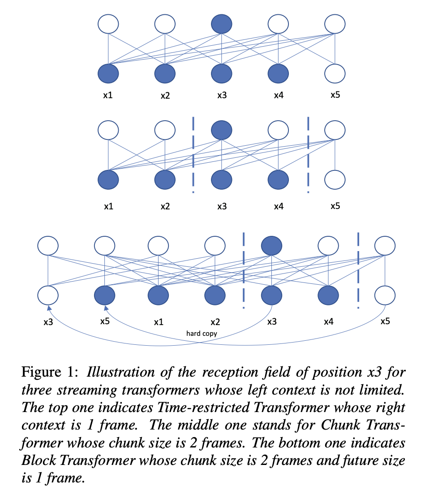

### 1. End-to-End Spelling Correction Conditioned on Acoustic Feature for Code-switching Speech Recognition
[Interspeech2021] [Link](https://www.isca-speech.org/archive/pdfs/interspeech_2021/zhang21d_interspeech.pdf)  
19/05/2022  
**_Note_**:  
Code switching (CS) definition: " In code-switching, multiple languages are freely interchanged within a single sentence or between sentences."  
**_Dataset_**: ASRU 2019 Mandarin-English Code-Switching Speech Recognition Challenge at [link](https://arxiv.org/pdf/2007.05916.pdf).  
Example samples:

| CS transcription | EN transcription |
| ---------------- | ---------------- |
| “我今天要去买一个 iPhone.” | asdfsdf |

_**Purpose**_: Vietnamese ASR usually faces this problem. Transcription comes from conversational speech usually include English word. Solving CS can enhance the accuracy for Vietnamese ASR.  
_**Content**_: Create a E2E spelling correction module, which is the post processing module for output of ASR. Use acoustic features append with LM features to compose the input for spelling correction model.

### 2. Improving Streaming Transformer Based ASR Under a Framework of Self-supervised Learning
[Interspeech2021] [Link](https://www.isca-speech.org/archive/pdfs/interspeech_2021/cao21b_interspeech.pdf)  
19/05/2022  
**_Purpose_**:  
SSL ASR architectures usually large and include transformer. Multi head attention (MHA) has to look at all the input before computing, therefore this architecture is hard to use as streaming.  
W2v2 for ASR has very good quality. How to turn it into streaming architecture for better speed of inferring? Will the performance be kept or only small reduction of accuracy?  
**_Solution_**:  
  
Left context is not limited. Right context includes 1 frame. The upper layers, the more right context it can capture because it will not affect much to the time latency. Can use `attention mask` to control the context that attention will capture.  
=> Can apply attention mask to non streaming model P and finetune it on laballed data L to get streaming model S.  

### 3. Robust wav2vec 2.0: Analyzing Domain Shift in Self-Supervised Pre-Training
[Interspeech2021] [Link](https://www.isca-speech.org/archive/pdfs/interspeech_2021/hsu21_interspeech.pdf)
20/05/2021  
Purpose:  
What if domain of unlabelled data trained for W2v2 differ from labelled data for finetuning ASR.  
=> Experiments show that using target domain data during pre-training leads to large performance improvements across a variety of setups.  
=> Pre-training on multiple domains improves generalization performance on domains not seen during training.  
Result:  
1. Does adding in-domain pre-training data help?  yes
2. Does adding pre-training data help if out-of-domain? Mix, does not always help
3. Does pre-training on diverse data improve robustness? yes
4. Is it still effective and robust with more labeled data? Yes, even if the labeled data is out of domain
5. Effect of pre-training data similarity to target domain? "If there is perfect domain match for the unlabeled data, labeled data and the target domain, then more
unlabeled data leads consistently to better performance" -> "unlabeled data leads consistently to better performance"
6. Effect of in-domain pre-training data size? Will improve performance both by *jointly training* and *continual training* two domains corpus.
7. Larger model, more pre-training and fine-tuning data: In general, bigger size brings better performance

=> This paper has good analysis about strategy to train/fine-tune ASR with in/out domain